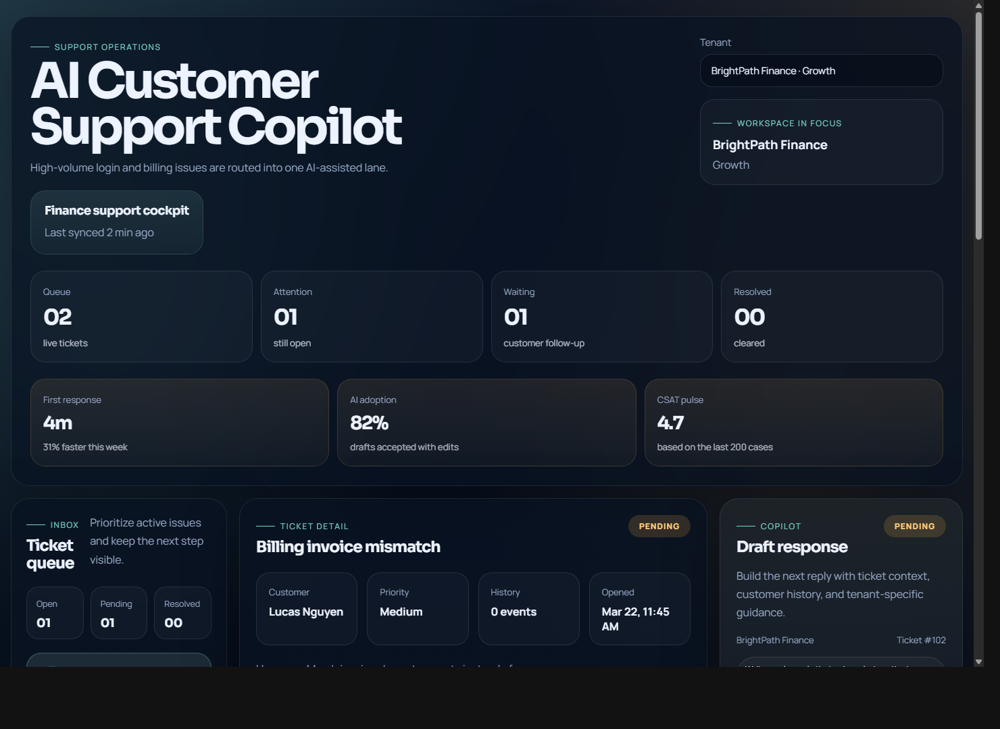
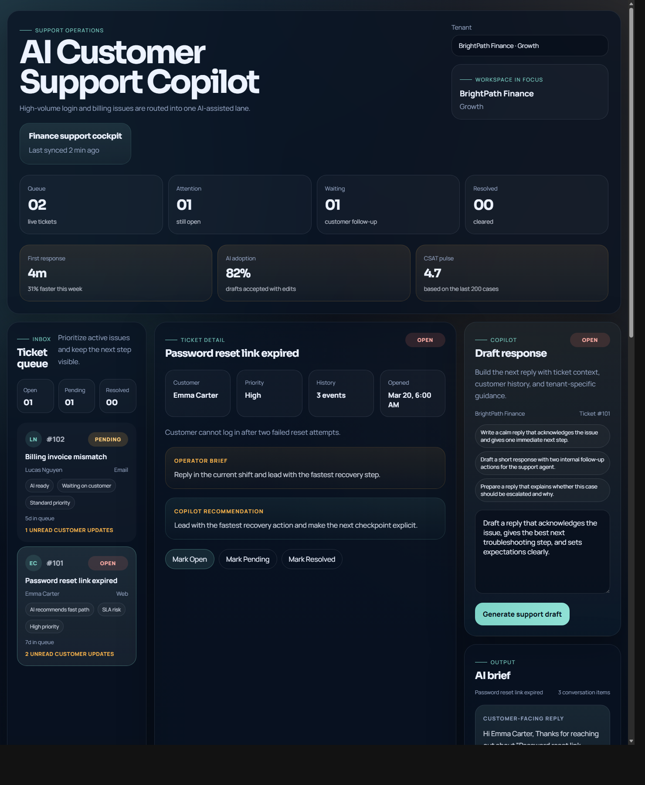
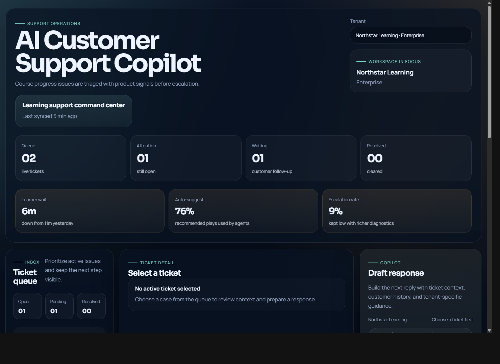

# AI Customer Support Copilot SaaS

AI Customer Support Copilot is a production-style support workspace designed to show how an AI assistant can fit into a real customer operations workflow. The experience combines ticket management, tenant-aware context, knowledge retrieval, and draft generation in a way that feels practical for a SaaS support team.

## What this project demonstrates

- AI-assisted reply drafting grounded in support context
- Multi-tenant SaaS workflow design for shared support teams
- Clear operational UI for triage, ticket review, and response preparation
- Full-stack architecture that supports both mock mode and live AI integration

## Use case

This type of system is commonly used for:

- SaaS customer support platforms
- Internal agent-assist tooling for support teams
- Help desk modernization initiatives
- Knowledge-grounded response workflows for B2B service teams

## Why this matters

This type of system is useful for:

- Support teams that need faster response drafting without losing context
- SaaS products that want AI assistance embedded into operational workflows
- Service organizations trying to standardize reply quality across agents
- Internal tools that combine knowledge retrieval with workflow automation

## Key capabilities

- Ticket inbox with status management and conversation history
- Tenant-specific knowledge context tied to the active workspace
- AI copilot panel for generating suggested customer replies
- Demo accounts with distinct support scenarios
- Mock AI mode for portfolio review without external credentials
- Optional OpenAI mode for live model-backed responses

## Architecture overview

The system is structured as a lightweight support operations stack:

Frontend (React + Redux Toolkit)
  ↓
API layer (Node.js + Express)
  ↓
Processing layer (ticket workflow, tenant context, AI reply generation)
  ↓
Storage (SQL.js)

AI responses can run in:

- Mock mode for deterministic local demos
- Live mode through OpenAI when credentials are provided

## Screenshots

### Operations overview



### Copilot draft workflow



### Tenant variation



## Technology snapshot

- React + Redux Toolkit frontend
- Node.js + Express backend
- SQL.js for lightweight relational storage
- Optional OpenAI integration for live AI output

## Run locally

### Backend

```bash
cd server
cp .env.example .env
npm install
npm run dev
```

Backend runs at `http://localhost:4000`.

### Frontend

Open a new terminal:

```bash
cd client
npm install
npm run dev
```

Frontend runs at `http://localhost:5173`.

If you are opening the app from a host browser outside WSL, use:

```bash
cd client
npm run dev:host
```

If port `4000` is already in use, point the frontend at a different backend:

```bash
cd server
PORT=4400 npm run dev
```

```bash
cd client
VITE_API_BASE_URL=http://172.31.221.39:4400/api npm run dev:host
```

## Optional real AI mode

Edit `server/.env`:

```env
OPENAI_API_KEY=your_key_here
OPENAI_MODEL=gpt-5.4-mini
```

If no key is present, the app stays in mock mode and still works fully.

This makes it easy to use the project in two ways:

- As a fully local portfolio demo with deterministic mock responses
- As a lightweight live-AI prototype backed by OpenAI

## Demo flow

1. Select a tenant.
2. Click any ticket.
3. Review the ticket details and knowledge base context.
4. Ask the copilot for a reply draft.
5. Update ticket status.

## Showcase mode

For static portfolio screenshots or demo states, the frontend also supports query parameters:

- `?tenant=1&ticket=102`
- `?tenant=1&ticket=101&demo=showcase`
- `?tenant=2&ticket=201&demo=showcase`

The Windows capture helper used for README screenshots lives at `scripts/capture_demo_screenshot.ps1`.
